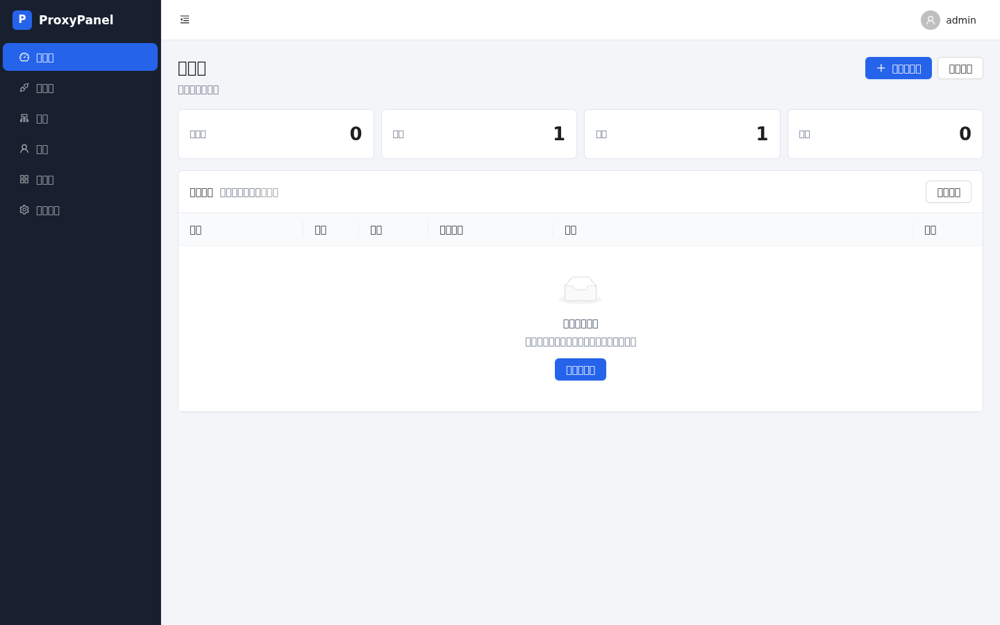
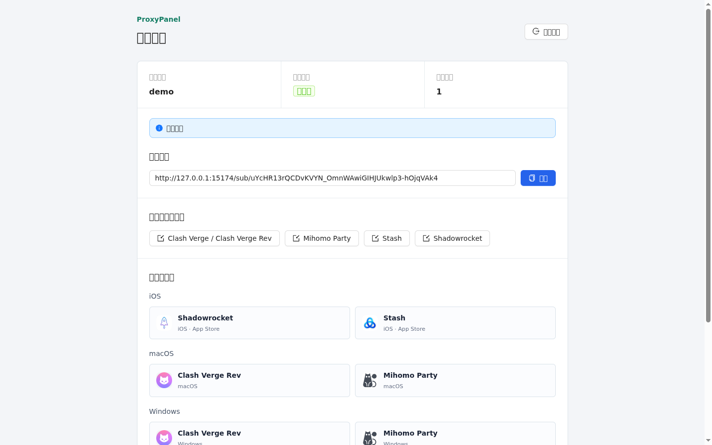

# ProxyPanel

ProxyPanel 是一个 mihomo/Clash 订阅管理面板，提供节点同步、用户订阅、模板配置和客户端分发能力。

## 亮点

- 可以将多个机场的节点合并管理，并输出为一个统一订阅。
- 可以为朋友或团队成员创建独立订阅账号，按用户分配可用节点。
- 每个用户拥有独立订阅地址，重置 token 后旧链接立即失效。
- 支持普通用户门户，用户可自行复制订阅、导入客户端或下载客户端。
- 可单个 Docker 容器部署，适合轻量自用或小范围共享。

## 界面预览

管理员后台：



普通用户门户：



## 主要功能

1. 订阅源管理：同步 mihomo/Clash YAML，支持单个或批量同步，并自动处理远端已删除节点。
2. 节点管理：支持手动导入、启用禁用、搜索筛选、批量操作和 YAML 编辑。
3. 用户订阅：管理员可创建订阅用户、绑定节点、重置密码，并为用户生成独立订阅地址。
4. 模板与客户端：支持订阅模板预览、节点顺序配置、客户端链接或本地文件分发。

## 技术栈

- 后端：Django、Django REST Framework
- 前端：React、Ant Design、Vite
- 数据库：SQLite
- 部署：Docker 单容器，Docker Compose 可选

## 快速开始

```bash
docker build -t proxypanel .
docker run -d \
  --name proxypanel \
  -e ADMIN_USERNAME=admin \
  -e ADMIN_PASSWORD=修改成你的管理员密码 \
  -p 5173:8000 \
  -v "$(pwd)/data:/app/data" \
  proxypanel
```

访问 `http://你的服务器IP:5173`。如果在本机运行，也可以访问 `http://127.0.0.1:5173`。

也可以使用 Docker Compose：

```bash
cp .env.example .env
docker compose up --build
```

默认管理员用户名是 `admin`。未设置 `ADMIN_PASSWORD` 时，系统会生成随机密码并保存到 `./data/admin_password`。SQLite 数据库默认挂载在 `./data/app.db`。

## 本地开发

后端：

```bash
cd backend
python3 -m venv .venv
. .venv/bin/activate
pip install -r requirements.txt
python manage.py migrate
ADMIN_USERNAME=admin ADMIN_PASSWORD=your-admin-password python manage.py initadmin
python manage.py runserver 0.0.0.0:8000
```

前端：

```bash
cd frontend
npm ci
npm run dev
```

本地开发访问 `http://127.0.0.1:5173`，Vite 会代理 `/api/` 和 `/sub/` 到后端。
